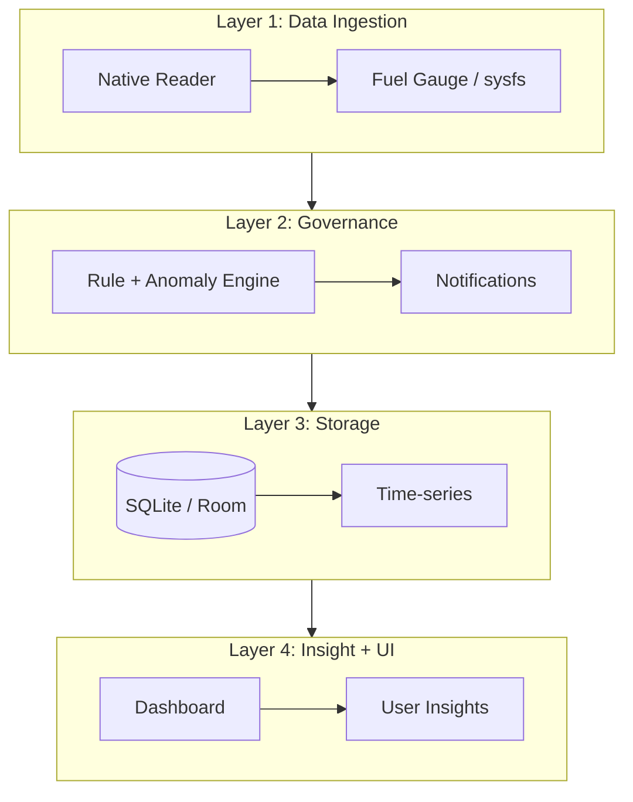

# 🔋 AmpereEye — The Battery Truth

[](https://opensource.org/licenses/MIT)
[](https://www.android.com)
[](https://kotlinlang.org)

AmpereEye คือโปรเจกต์ต้นแบบสำหรับแอปวิเคราะห์แบตเตอรี่ โดยโฟกัสที่การอ่านค่ากระแสไฟจากฮาร์ดแวร์จริงบน Android และแสดงผลผ่าน React dashboard ที่ใช้งานได้ทันที.

## 🚀 สถานะปัจจุบันของรีโพ

รีโพนี้มี 2 ส่วนหลัก:

1. **Frontend Prototype (พร้อมรัน)**
   - React + TypeScript + Vite
   - หน้า **Pulse / Memory / Enforcer** และ Notification simulation
2. **Android Native Bridge (โครงสร้างเริ่มต้น)**
   - มี JNI C++ (`native-lib.cpp`) สำหรับอ่าน `current_now`
   - มี Capacitor Android plugin (`BatteryTruthPlugin.kt`) สำหรับส่งค่าไปยัง JavaScript

> หมายเหตุ: ส่วน Android ยังเป็นโครงสร้าง integration ระดับต้นแบบในรีโพนี้ (ยังไม่ใช่แอป Android ที่ประกอบครบทั้ง pipeline จริงตามสถาปัตยกรรมเป้าหมาย)

## ✨ ความสามารถที่มีในโค้ดปัจจุบัน

- แสดงผล dashboard ต้นแบบสำหรับติดตามข้อมูลแบตเตอรี่
- ดึงค่า `current_ma` จาก plugin (เมื่อรันบน Android native environment ที่รองรับ)
- fallback ได้เมื่อรันบน Web/desktop โดยไม่ทำให้ UI พัง
- มีคำสั่ง build/lint สำหรับตรวจคุณภาพโค้ด frontend

## 🏗️ สถาปัตยกรรมเป้าหมาย (Target Architecture)

AmpereEye ออกแบบในระยะยาวเป็น 4 ชั้นดังนี้:



## 🗄️ โครงสร้างข้อมูล (Conceptual Schema)

ตารางเชิงแนวคิดที่ใช้ในการออกแบบ:

- `battery_snapshots`
- `charge_cycles`
- `app_usage`
- `wakelock_offenders`

> หมายเหตุ: schema ข้างต้นเป็นเป้าหมายเชิงสถาปัตยกรรม ยังไม่ได้มี implementation ฐานข้อมูลครบทั้งหมดในรีโพ frontend prototype นี้

## 🛠️ เทคโนโลยีที่ใช้

### Frontend (Implemented)
- React 18 + TypeScript
- Tailwind CSS v3
- Vite
- Lucide React

### Android Bridge (Partial / Prototype)
- Kotlin (Capacitor plugin)
- C++ (JNI)
- sysfs path: `/sys/class/power_supply/battery/current_now`

## 📲 Setup & Development

### 1) Frontend Dashboard
```bash
npm install
npm run dev
```

Production build:
```bash
npm run build
```

Code quality check:
```bash
npm run lint
```

### 2) Android Integration (เบื้องต้น)
หากต้องการใช้ plugin จริงบน Android จำเป็นต้องมีโปรเจกต์ Capacitor/Android ที่ผูก native library และ plugin registration ครบถ้วน.


## 🔗 MCP Server URL

เพิ่ม utility สำหรับสร้าง URL ของ MCP server ไว้ที่ `src/services/mcpServerUrl.ts` เพื่อให้ config ได้จาก environment หรือ runtime โดยไม่ hardcode ในหลายจุด.

ลำดับการเลือก base URL:
1. `options.baseUrl`
2. `VITE_MCP_SERVER_BASE_URL`
3. `window.location.origin` (fallback เป็น `http://localhost:3000` เมื่อไม่มี browser runtime)

ตัวอย่างการใช้งาน:

```ts
import { createMcpServerUrl } from './services/mcpServerUrl';

const url = createMcpServerUrl({ path: '/mcp' });
// เช่น https://your-host.example/mcp
```

## 🤝 การมีส่วนร่วม

ยินดีรับ Issue และ Pull Request โดยเฉพาะด้าน:
- ความแม่นยำของการอ่านค่าแบตเตอรี่บนอุปกรณ์จริง
- การเชื่อมต่อ native ↔ web ที่เสถียรขึ้น
- การต่อยอด storage/model layer ให้ครบตาม architecture

## 📄 License

MIT License
