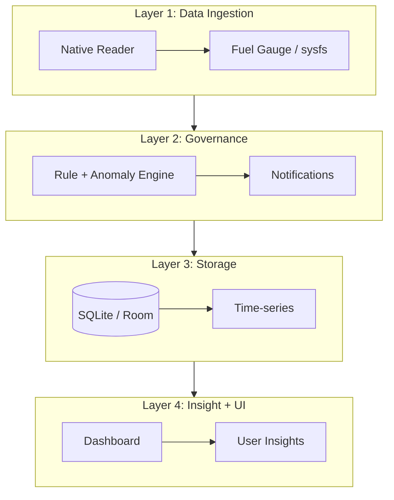

# 🔋 AmpereEye — The Battery Truth

[](https://opensource.org/licenses/MIT)
[](https://www.android.com)
[](https://kotlinlang.org)

AmpereEye คือโปรเจกต์ต้นแบบสำหรับแอปวิเคราะห์แบตเตอรี่ที่อ่านค่ากระแสไฟจริงจาก Android และแสดงผลผ่าน React dashboard.

## 🚀 สถานะปัจจุบันของรีโพ

รีโพนี้มี 2 ส่วนหลัก:

1. **Frontend Prototype (พร้อมรัน)**
   - React + TypeScript + Vite
   - หน้า **Pulse / Memory / Enforcer** และ Notification simulation
2. **Android Native Bridge (โครงสร้างเริ่มต้น)**
   - JNI C++ (`native-lib.cpp`) สำหรับอ่าน `current_now`
   - Capacitor Android plugin (`BatteryTruthPlugin.kt`) สำหรับส่งค่าไปยัง JavaScript

> หมายเหตุ: ส่วน Android ยังเป็นระดับต้นแบบ และยังไม่ใช่ pipeline production แบบครบวงจร.

## ✨ ความสามารถในโค้ดปัจจุบัน

- แสดงผล dashboard สำหรับติดตามข้อมูลแบตเตอรี่
- อ่านค่า `current_ma` จาก plugin เมื่อรันบน Android ที่รองรับ
- มี mock fallback บน Web/Desktop เพื่อให้ UI ทำงานต่อเนื่อง
- จัดเก็บประวัติ charge cycle ลง IndexedDB พร้อม fallback เป็น localStorage
- มีคำสั่ง build/lint สำหรับตรวจคุณภาพโค้ด frontend

## 🏗️ สถาปัตยกรรมเป้าหมาย (Target Architecture)

AmpereEye ออกแบบในระยะยาวเป็น 4 ชั้นดังนี้:



## 🗄️ โครงสร้างข้อมูล (Conceptual Schema)

ตารางเชิงแนวคิดที่ใช้ในการออกแบบ:

- `battery_snapshots`
- `charge_cycles`
- `app_usage`
- `wakelock_offenders`

> หมายเหตุ: schema ข้างต้นเป็นเป้าหมายเชิงสถาปัตยกรรม ยังไม่ได้มี implementation ฐานข้อมูลครบทั้งหมดในรีโพนี้.

## 🛠️ เทคโนโลยีที่ใช้

### Frontend (Implemented)
- React 18 + TypeScript
- Tailwind CSS v3
- Vite
- Lucide React

### Android Bridge (Partial / Prototype)
- Kotlin (Capacitor plugin)
- C++ (JNI)
- sysfs path: `/sys/class/power_supply/battery/current_now`

## 📲 Setup & Development

### ติดตั้งและรัน
```bash
npm install
npm run dev
```

### Build production
```bash
npm run build
```

### Lint
```bash
npm run lint
```

## 🧪 Testing

ขณะนี้รีโพมี static checks เป็นหลัก:

- `npm run lint`
- `npm run build`

> หมายเหตุ: ยังไม่มี unit/integration test suite แยกอย่างเป็นทางการ.

## 🔗 MCP Server URL

Utility สำหรับสร้าง URL ของ MCP server อยู่ที่ `src/services/mcpServerUrl.ts` เพื่อให้ config ได้จาก environment หรือ runtime โดยไม่ hardcode หลายจุด.

ลำดับการเลือก base URL:
1. `options.baseUrl`
2. `VITE_MCP_SERVER_BASE_URL`
3. `window.location.origin` (fallback เป็น `http://localhost:3000` เมื่อไม่มี browser runtime)

ตัวอย่างการใช้งาน:

```ts
import { createMcpServerUrl } from './services/mcpServerUrl';

const url = createMcpServerUrl({ path: '/mcp' });
// เช่น https://your-host.example/mcp
```

## 🗂️ รายการข้อเสนอแนะที่ยังคงค้าง (Backlog)

### English
- Add automated unit and integration tests for core battery services.
- Add end-to-end validation for Android plugin ↔ web bridge communication.
- Implement persistent schema for snapshots and anomaly events (SQLite/Room).

### ภาษาไทย
- เพิ่มชุดทดสอบอัตโนมัติ (unit/integration) สำหรับ service หลักของระบบแบตเตอรี่
- เพิ่มการทดสอบแบบ end-to-end สำหรับการสื่อสารระหว่าง Android plugin กับ web bridge
- ทำ persistence schema จริงสำหรับ snapshots และเหตุการณ์ผิดปกติ (SQLite/Room)

> หมายเหตุ: ลบรายการข้อเสนอแนะที่ทำเสร็จแล้วออกแล้ว เพื่อไม่ให้ปะปนกับงานที่ดำเนินการเสร็จสิ้น.

## 🤝 การมีส่วนร่วม

ยินดีรับ Issue และ Pull Request โดยเฉพาะด้าน:
- ความแม่นยำของการอ่านค่าแบตเตอรี่บนอุปกรณ์จริง
- ความเสถียรของ native ↔ web bridge
- การต่อยอด storage/model layer ให้ครบตาม architecture

## 📄 License

MIT License
